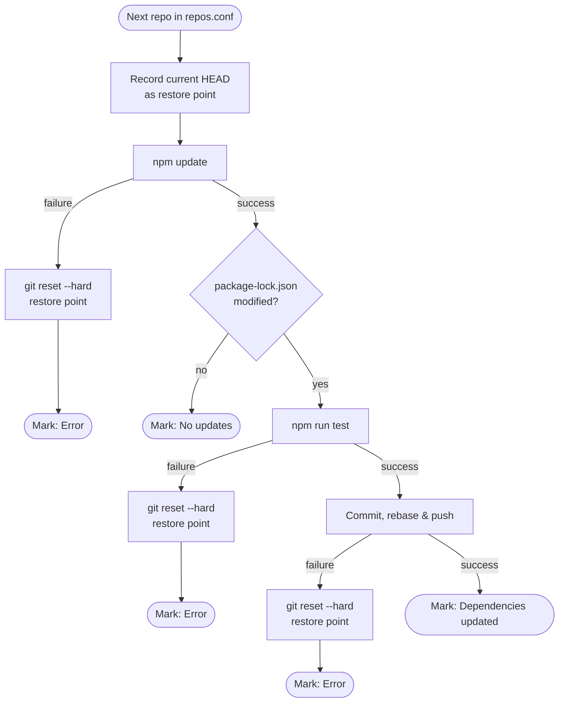

# npm-repo-updater

A Bash script that automates `npm` dependency updates across multiple local Git repositories — including:

🧪 test verification<br>
🛡️ safe rollback on failure<br>
🔍 CI/CD status check for GitHub Actions

## Usage

1. Download the script:

```bash
curl -O https://raw.githubusercontent.com/tsmx/npm-repo-updater/master/npm-repo-updater.sh
chmod +x npm-repo-updater.sh
```

2. Create `repos.conf` in the same directory:

```bash
cat > repos.conf <<EOF
# List repository paths relative to this directory
projects/my-api
projects/frontend-app
projects/shared-utils
EOF
```

3. Run:

```bash
./npm-repo-updater.sh
```
   
See [Usage](#usage) for available flags (`--log`, `--check-ci`).

## How it works

`npm-repo-updater.sh` iterates over a list of local repository paths defined in `repos.conf` and processes each one through the following pipeline:



After all repositories have been processed, a [summary table](#summary) is printed showing each repo's outcome.

## Requirements

- Bash 4.0+
- Git
- Node.js / npm
- Each repository must have a `test` script defined in its `package.json`
- (Optional) GitHub CLI (`gh`) for `--check-ci` functionality

### Setting up GitHub CLI for CI Status Checking

To use the `--check-ci` flag, you need the GitHub CLI installed and authenticated:

1. **Install GitHub CLI:** Follow instructions at https://cli.github.com
2. **Authenticate:** Run `gh auth login` and follow the prompts
3. **Verify:** Run `gh auth status` to confirm authentication

The GitHub CLI securely manages authentication tokens and handles them automatically, so you don't need to manage tokens manually.

> **No tests in a repo?** The script requires `npm run test` to exit with code `0`. If a repository has no test suite, add a no-op test script to its `package.json` so the update pipeline can still run safely:
>
> ```json
> "scripts": {
>   "test": "node -e \"process.exit(0)\""
> }
> ```
>
> This uses Node.js — already present in any npm project — and works identically on Linux, macOS, and Windows regardless of the shell npm uses internally.

## Configuration

Create a `repos.conf` file **in the same directory as the script**. The file is read line by line via `mapfile`; each non-blank, non-comment line is treated as a repository path **relative to the script's location**.

```
# repos.conf — paths are relative to the directory containing npm-repo-updater.sh

# Sibling directories
../my-api
../frontend-app

# Subdirectories
projects/shared-utils

# Deeper nesting is supported
../../workspace/legacy-service
```

Tips:
- Lines starting with `#` are treated as comments and ignored.
- Blank lines are ignored.
- Paths may use `..` to traverse above the script's directory.
- Trailing whitespace on a line is preserved by `mapfile` — avoid it to prevent path resolution failures.

## Usage

```bash
# Basic run
./npm-repo-updater.sh

# With logging to a file
./npm-repo-updater.sh --log /var/log/npm-repo-updater.log

# With CI status checking (requires GitHub CLI)
./npm-repo-updater.sh --check-ci

# With both logging and CI status checking
./npm-repo-updater.sh --log /var/log/npm-repo-updater.log --check-ci
```

### Options

| Option | Description |
|---|---|
| `--log <file>` | Append a timestamped log of all output to the given file. |
| `--check-ci` | After pushing updates, check GitHub Actions CI status for each commit (requires `gh` CLI to be installed and authenticated). |

## Error handling

Every failure mode is handled explicitly. If an error occurs, the script:

- Logs a clear `❌` error message describing what failed.
- Runs `git reset --hard <ORIG_HEAD>` to restore the repository to the exact state it was in before the update started — this covers partially modified files (`npm update`), staged changes (`git add`), and even local commits that were made before a push failure.
- Marks the repository as `Error` in the summary and moves on to the next one.

The script **never aborts the entire run** due to a single repo failing; all repos in `repos.conf` are always attempted.

Possible status values per repository:

| Status | Meaning |
|---|---|
| `Dependencies updated` | `npm update` produced changes, tests passed, and changes were pushed successfully. |
| `No updates` | `npm update` ran successfully but `package-lock.json` was unchanged — nothing to commit. |
| `Error` | A failure occurred (npm, tests, or git). Changes were reverted. |

### CI Status (when using `--check-ci`)

When running with the `--check-ci` flag, an additional "CI Status" column is displayed showing the GitHub Actions workflow status:

| CI Status | Meaning |
|---|---|
| `CI passed` | All GitHub Actions workflows for the pushed commit have completed successfully. |
| `CI failed` | At least one GitHub Actions workflow failed, was cancelled, or timed out. |
| `CI running` | Workflows are still running after the 5-minute polling timeout. |
| `No CI` | No GitHub Actions workflows were found for the commit (repo may not have workflows configured). |
| `-` | No push was made for this repo (status is `Error` or `No updates`). |

## Logging

Without `--log`, all output goes to stdout only.

With `--log <file>`, **every log line is also appended** to the specified file with a timestamp prefix:

```
2026-03-06 14:32:01 → Processing repository: /home/user/repos/my-api
2026-03-06 14:32:04 → npm update…
2026-03-06 14:32:09 → Changes found. Running npm run test…
2026-03-06 14:32:21 → Tests OK. Commit & Push…
2026-03-06 14:32:23 ✔️ Repo ../my-api successfully updated
```

The log file is plain text (no ANSI color codes), making it safe to use with log aggregators or `grep`.

## Summary

At the end of each run, a table is printed to stdout:

```
Repository                               | Status
-----------------------------------------+--------------------------
my-api                                   | ✅ Dependencies updated
frontend-app                             | 🔘 No updates
shared-utils                             | ❌ Error
```

### With `--check-ci`

When using the `--check-ci` flag, an additional CI Status column is shown:

```
Repository                               | Dependencies             | CI Status
-----------------------------------------+--------------------------+----------------------
my-api                                   | ✅ Dependencies updated  | ✅ CI passed
frontend-app                             | 🔘 No updates            | 🔘 -
shared-utils                             | ❌ Error                 | 🔘 -
legacy-service                           | ✅ Dependencies updated  | 🔘 No CI
worker-service                           | ✅ Dependencies updated  | ❌ CI failed
org/billing-api                          | ✅ Dependencies updated  | ✅ CI passed
org/auth-service                         | 🔘 No updates            | 🔘 -
```

Repositories with status `Error` are highlighted in red in the terminal output.

## License

MIT
